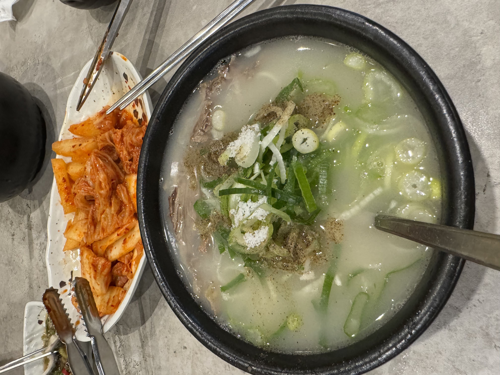
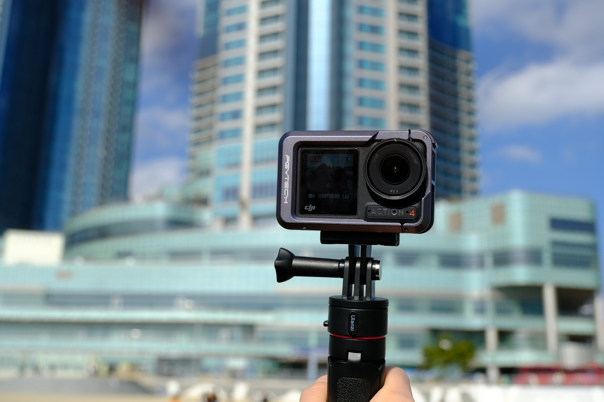

---
tags:
  - 旅行/韩国
  - 韩国/釜山
---
# 🏂🏻 Busan 釜山

::: details 更多图片

:::

## 🧩 主要景点

### 🌊 海云台

定位：海雲台 해운대경찰서

基于上次短暂的釜山行，我们已经把釜山南部松岛的大部分景点游览完了，所以这次选择了著名景点——海云台，海云台位于釜山东北区域，之所以选择这里其中很大一部分原因是因为预定了[釜山伊甸谷滑雪一日游](https://www.klook.com/zh-CN/activity/6891-eden-valley-ski-resort-day-tour-busan/)，因为接送大巴的路线是从釜山站自南向北最后到达海云台站的，大概十点在海云台站上车（能够保持充足的睡眠🤣）。其实如果这个行程中间有广安里海滩的话，我会更倾向于在广安里住宿😁因为面对着广安里大桥夜景更美。

但其实另一原因是，对于不同的海边我总想亲身去看一下，和女朋友一起亲身丈量这个世界；即使可能海的轮廓都是那么类似，但各个海湾的游客、景色、景点也不尽相同；即使已多次来过这个地方，但处于不同的人生阶段所感受到的景色和氛围以及霎时的回忆瞬间，都会让自身感触

### 🌆 X the Sky

定位：BUSAN X the SKY 부산 엑스 더 스카이
 
价格：使用 klook 95折优惠券之后 220💰RMB 两人
 
链接：[釜山海云台X the Sky门票](https://www.klook.com/zh-CN/activity/81280-busan-haeundae-lct-x-the-sky-admission-ticket/)

这里有着全世界最高的星巴克、56秒直达100层的电梯、以及顶层的透明走廊（恐高者请谨慎），解锁了人生第一次在全世界最高的星巴克看日落的体验，远处还能看到广安大桥

::: details 更多图片

:::

### 🏂🏻 伊甸谷滑雪场

定位：Eden Valley Resort 에덴밸리리조트
 
价格：使用 klook 95折优惠券之后 1090💰RMB 两人
 
链接：[釜山伊甸谷滑雪一日游](https://www.klook.com/zh-CN/activity/6891-eden-valley-ski-resort-day-tour-busan/)

本来以为二月初会有下雪的，结果还是太天真了，虽说伊甸谷是个处于山顶的人造雪场，但没有下雪多少还是有点失望（以后一定要去滑粉雪），伊甸谷在二月末三月初基本就不开了，现在三月初我看 klook 已经下架活动了，二月初体验的时候雪场的雪已经开始化了，不过也有可能是那几天的天气回暖有关

这次滑的是双板，因为听说单板上手时间比较长。虽说十年前小时候在首尔那边的滑雪场滑过一次，但重新上手之后还是非常难，尤其是坡度大的时候很难掌握前后的平衡，很容易往前倾或者往后倾，进而导致摔倒。

后面做了缆车上了半山腰的新手道之后，发现其实坡度不大的话，只要保持刹车的刻滑，就比较容易控制整个重心，并且左右方向也很好控制，整个滑雪体验蹭蹭涨

## 🍲 打卡美食

### 🐔 参鸡汤

定位：传说中的參鸡汤 해운대소문난삼계탕
 
价格：点了一份 18000 KRW 的药膳参鸡汤以及一份 16000 KRW 的人参参鸡汤

个人觉得非常值得打卡，会赠送一堆小料以及人参酒，不过那天三个半小时的夜机加上两个半小时的 KTX ，以及叠加前一天肠胃炎刚刚好的debuff，这顿参鸡汤吃得并没有那么美滋滋，不过这个腌白菜倒是挺新奇的，是那种新鲜白菜混合了酱的，不是其他那种腌菜形态的腌白菜，虽然没有那么入味，但是吃到后面会吃到白菜的甜味，也没有那么辛辣。

参鸡汤里面有一整只小鸡，鸡汤整体是没什么味道的，需要自己加胡椒盐，鸡肚子里面还包裹着米饭，一个成年人点一份足够了

### 🍗 BHC炸鸡

定位：BHC Chicken, Haeundae Paledecz BHC치킨 해운대팔래드점
 
价格：cheese combo 两万多KRW

我们是逛完 X the Sky 走回去酒店的途中顺路take out的，就近随便定位找一家就好，感觉bhc的出品都很稳定，真的百吃不厌，比国内的炸鸡都要好吃非常多，上次在首尔吃了原味和芝士的都非常好吃，这次还是选的芝士

> [!WARNING] 要注意，包裹芝士粉炸鸡最好不要放隔夜，不然炸鸡会返油将芝士粉糊成一团😅

### 🦀 麻浦家生腌

定位：Mipo-jib 미포집 해운대본점
 
我们这次因为在海云台附近，所以选的是海云台总店，听说广安里有一家分店，人也没那么多
 
价格：70000 KRW，生腌套餐 35000 KRW 一人，两人起点

到了之后发现这里有范冰冰的签名，是去年釜山电影节来的。门口有自助排号机，但是需要 KR 手机号，没有 KR 手机号的需要去前台跟服务员拿个号，服务员会在排号机拿一个号然后给你手写一张号码纸，然后在门外静候就行了，会有服务员叫号的

整体来说值得来尝试一下，那个蛋黄芝麻酱挺惊艳的，包含芝麻油搅拌后用来拌虾和贝壳类都很不错，套餐赠送的小吃很多都是第一次见到，比如吃起来是草莓味像是酸浆草的草、腌包菜

> [!WARNING] 全场唯一需要注意的是，生腌酱蟹可能会吃不习惯，吃到后面可能会觉得很腥，难以下咽，应该是蟹黄那部分导致的🤡

### 🥘 雪浓汤

定位：Inamjang(Myeong-dong Branch) 이남장 명동점

这个在首尔，最后一天去首尔返程的时候去明洞最大的 olive young 的途中吃的

汤好喝，女朋友点的牛杂汤，我点的雪浓汤，每份的料都非常足，加了满满的胡椒粉之后更是刺激，喝一口整个人都暖了起来。不过感觉韩国这边的汤味道都基本是让你自己加盐的，即使自己加了盐，味道也相对比较淡

## 📷 旅行搭档

### 大疆OSMO Action 4

记录生活小能手，断断续续录制 1080P 的话感觉用一天都行，就是戴了 PGYTECH 这个兔笼之后重量蹭蹭涨；

滑雪最好还是使用弹力胸带或者头带会比较好，一开始使用官方的曲面粘接底座贴到滑雪头盔上，结果用了一会之后就松动了，后面根本贴不紧

