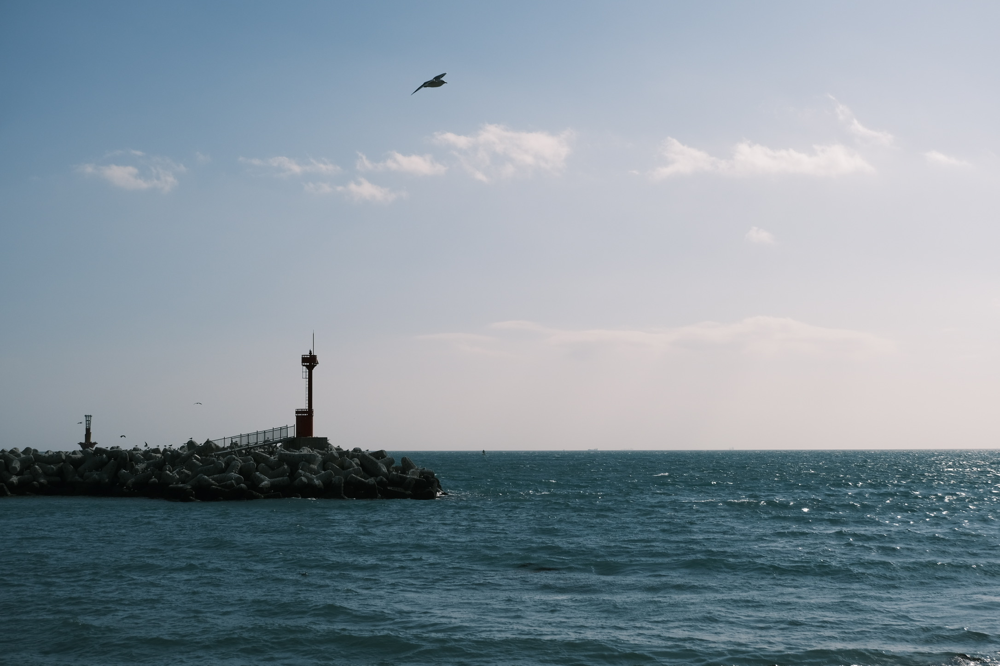
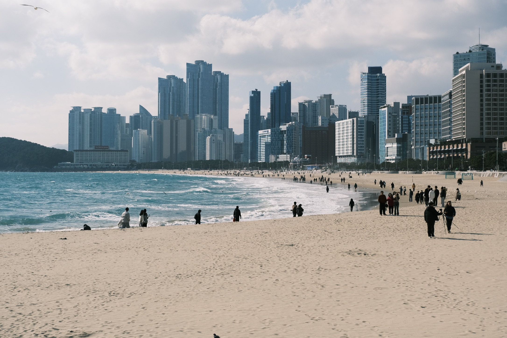
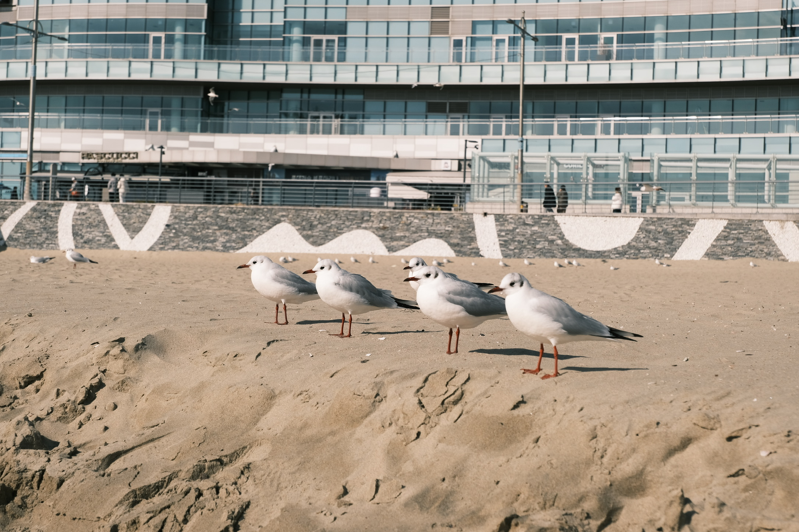
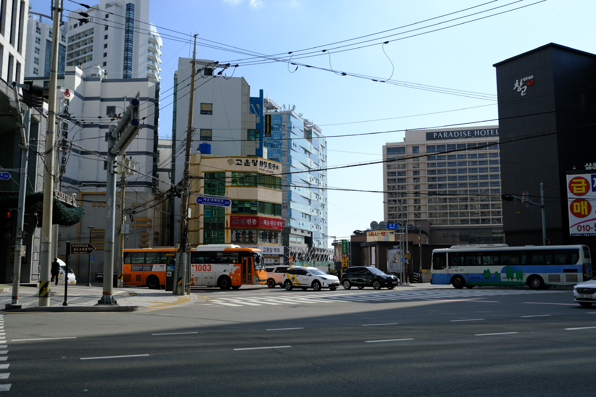
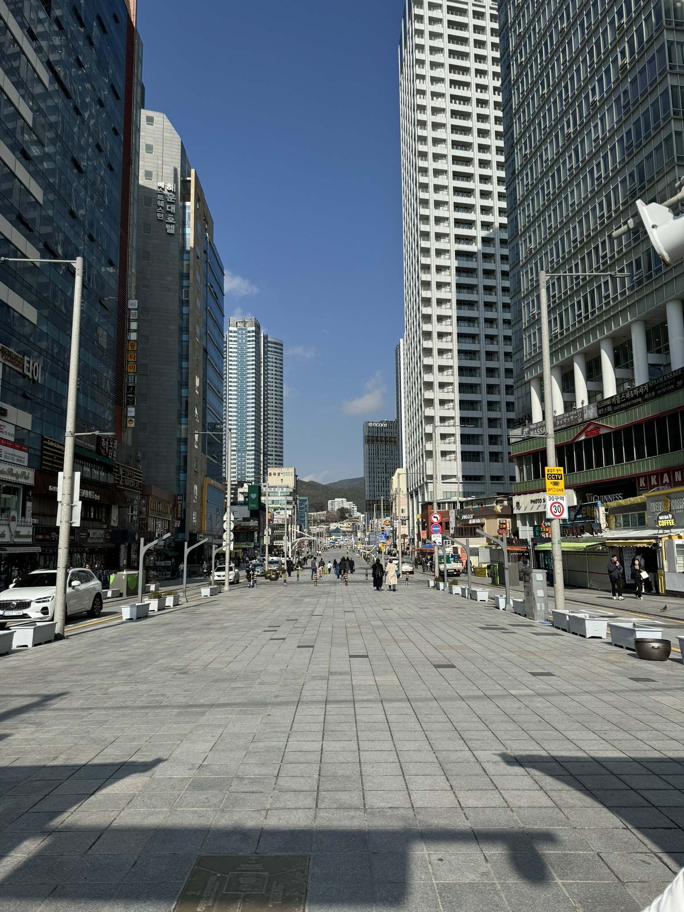
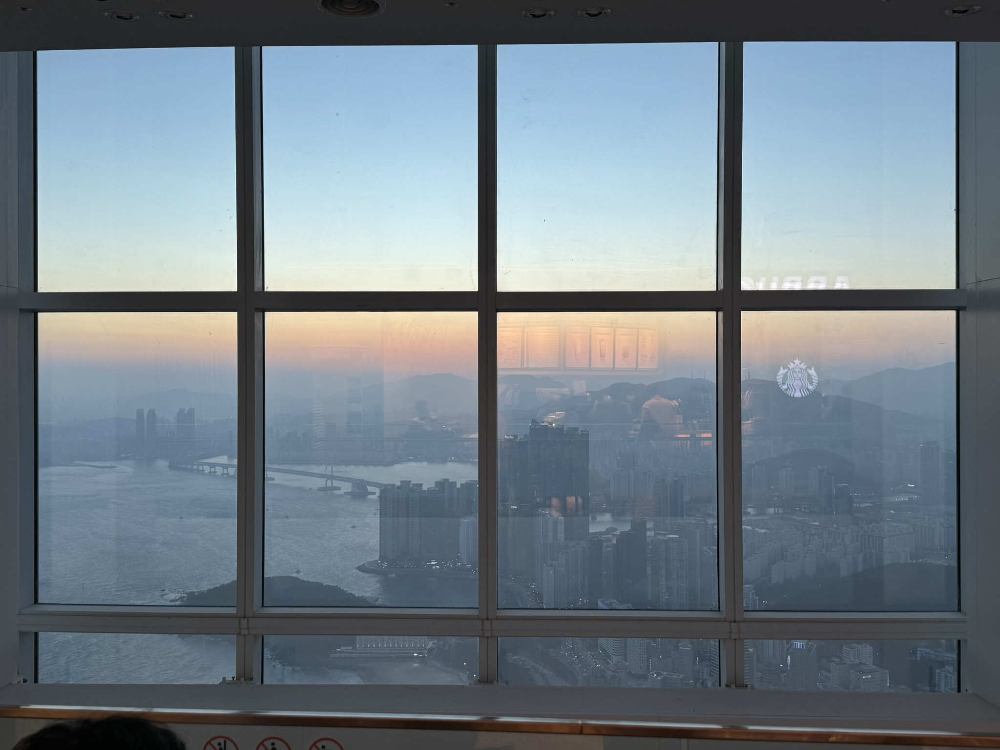
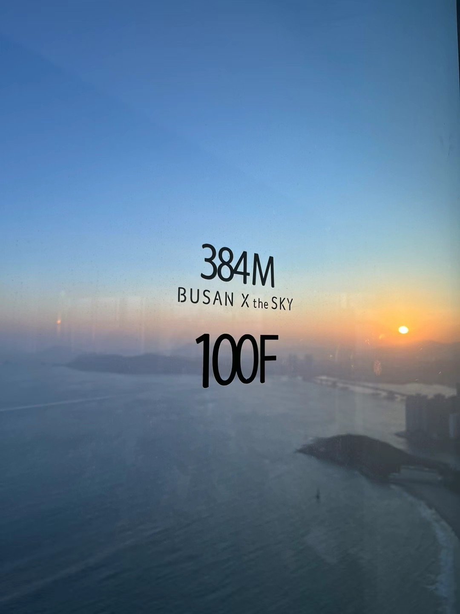
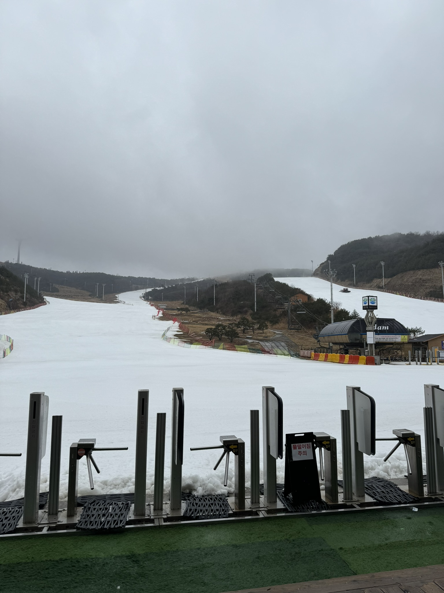

---
tags:
  - 旅行/韩国
  - 韩国/釜山
---
# 🏂🏻 Busan 釜山

::: details 更多图片

:::

## 🧩 主要景点

### 🌊 海云台

定位：海雲台 해운대경찰서

基于上次短暂的釜山行，我们已经把釜山南部松岛的大部分景点游览完了，所以这次选择了著名景点——海云台，海云台位于釜山东北区域，之所以选择这里其中很大一部分原因是因为预定了[釜山伊甸谷滑雪一日游](https://www.klook.com/zh-CN/activity/6891-eden-valley-ski-resort-day-tour-busan/)，因为接送大巴的路线是从釜山站自南向北最后到达海云台站的，大概十点在海云台站上车（能够保持充足的睡眠🤣）。其实如果这个行程中间有广安里海滩的话，我会更倾向于在广安里住宿😁因为面对着广安里大桥夜景更美。

但其实另一原因是，对于不同的海边我总想亲身去看一下，和女朋友一起亲身丈量这个世界；即使可能海的轮廓都是那么类似，但各个海湾的游客、景色、景点也不尽相同；即使已多次来过这个地方，但处于不同的人生阶段所感受到的景色和氛围以及霎时的回忆瞬间，都会让自身感触

### 🌆 X the Sky

定位：BUSAN X the SKY 부산 엑스 더 스카이
价格：使用 klook 95折优惠券之后 220💰RMB 两人
链接：[釜山海云台X the Sky门票](https://www.klook.com/zh-CN/activity/81280-busan-haeundae-lct-x-the-sky-admission-ticket/)

这里有着全世界最高的星巴克、56秒直达100层的电梯、以及顶层的透明走廊（恐高者请谨慎），解锁了人生第一次在全世界最高的星巴克看日落的体验

::: details 更多图片

:::

### 🏂🏻 伊甸谷滑雪场

定位：Eden Valley Resort 에덴밸리리조트
价格：使用 klook 95折优惠券之后 1090💰RMB 两人
链接：[釜山伊甸谷滑雪一日游](https://www.klook.com/zh-CN/activity/6891-eden-valley-ski-resort-day-tour-busan/)

本来以为二月初会有下雪的，结果还是太天真了，虽说伊甸谷是个处于山顶的人造雪场，但没有下雪多少还是有点失望（以后一定要去滑粉雪），伊甸谷在二月末三月初基本就不开了，现在三月初我看 klook 已经下架活动了，二月初体验的时候雪场的雪已经开始化了，不过也有可能是那几天的天气回暖有关

## 🍲 打卡美食
参鸡汤、百吃不厌的bhc炸鸡、麻浦生腌、章鱼锅、雪浓汤、1w2 KRW的草莓