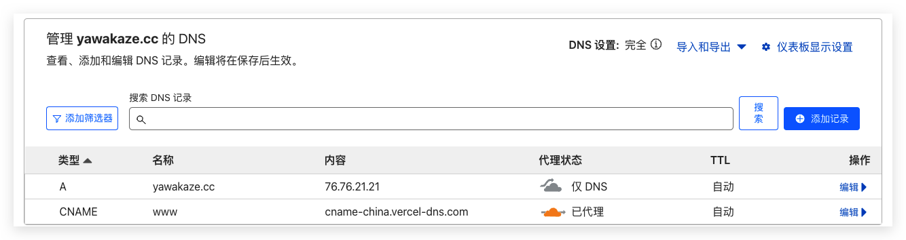
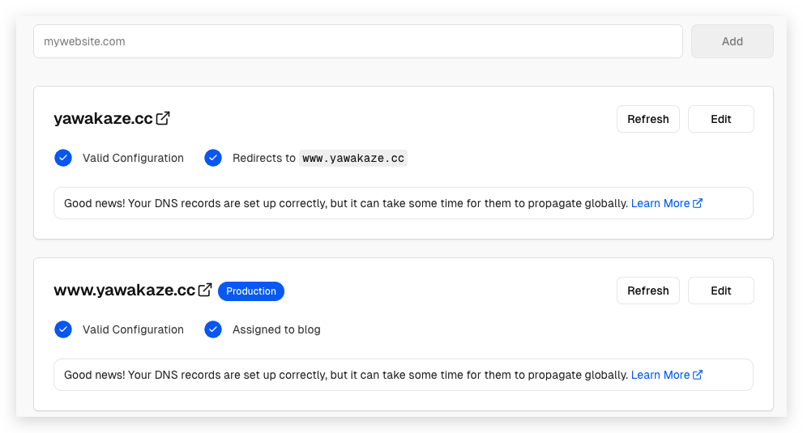

---
tags:
  - 博客建设/域名
  - 域名
  - Cloudflare
  - Vercel
---

# 解析CloudFlare域名并绑定到Vercel应用

1. 增加A记录，名称设置为域名名称，指向 Vercel 服务器地址 `76.76.21.21`
2. 增加CNAME记录，名称设置www，指向 `cname-china.vercel-dns.com` 并开启代理 
3. Vercel项目-Settings-Domains，添加域名 `yawakaze.cc` 并选择推荐选项即可

